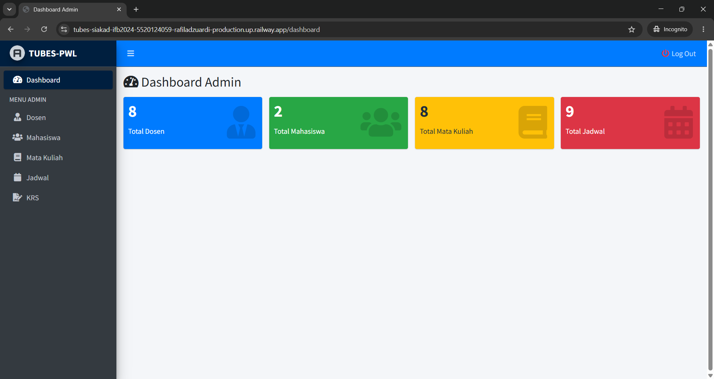
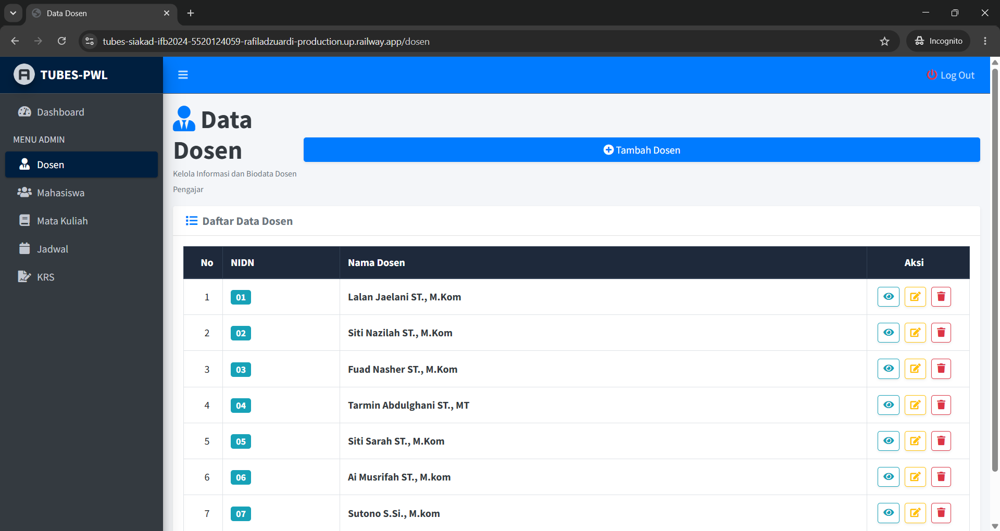
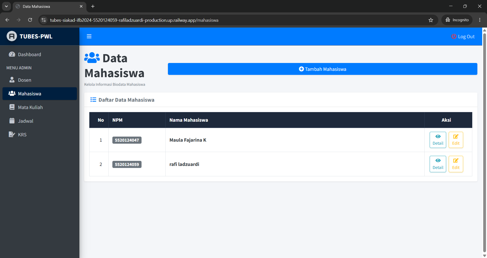
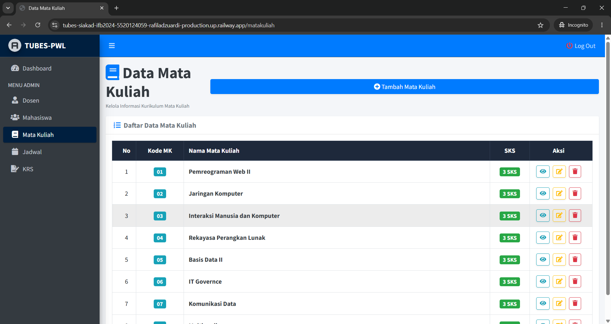
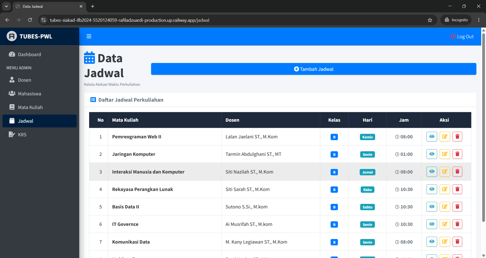
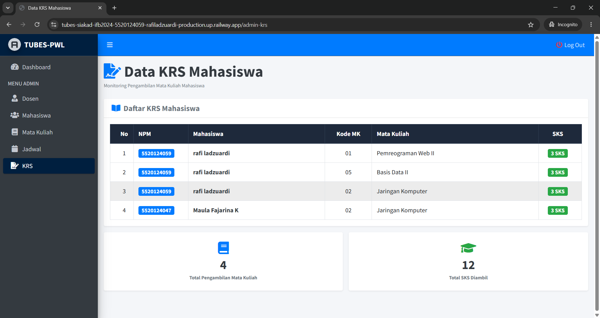
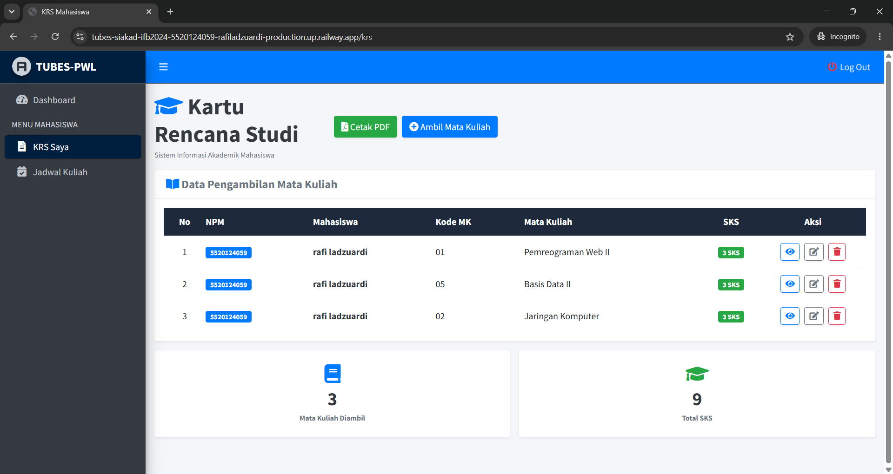

# Tugas Besar SIAKAD - IFB2024 - 5520124059 - Rafi ladzuardi

##  Link Aplikasi (Sudah Online)
Proyek ini sudah sukses di-hosting dan bisa langsung kamu akses secara publik lewat link di bawah ini:
 **[SIAKAD Online - Railway](https://tubes-siakad-ifb2024-5520124059-rafiladzuardi-production.up.railway.app/)**

>  **Udah Nyaman di HP:** Semua halaman di dalam aplikasi ini sudah diperbaiki layout-nya. Tampilan dijamin aman, rapi, responsif, dan tidak meluber kalau dibuka lewat browser handphone.

---

##  Akun untuk Coba Login (Demo Accounts)
Biar tidak ribet buat akun baru saat memeriksa, silakan pakai akun uji coba di bawah ini untuk melihat fitur masing-masing role:

###  1. Akun Admin / Dosen
* **Email:** `admin@gmail.com`
* **Password:** `admin123`

###  2. Akun Mahasiswa
* **Email:** `rafiladzuardi@gmail.com`
* **Password:** `12345678`

---

##  A. Tentang Aplikasi Ini
**SIAKAD (Sistem Informasi Akademik)** ini adalah sebuah platform web yang dibuat khusus untuk mempermudah urusan data perkuliahan di kampus. Mulai dari mengelola data dasar (dosen, mahasiswa, mata kuliah), mengatur jadwal belajar-mengajar harian, sampai ke proses mahasiswa mengambil mata kuliah pilihannya (KRS) secara online, semuanya sudah terintegrasi dengan rapi di sini.

---

##  B. Menu & Kegunaan Tiap Halaman

1. **Halaman Utama (Landing Page)**
   Tempat awal saat pertama kali membuka web. Isinya info sekilas tentang kampus dan ada tombol khusus untuk mengarahkan pengguna ke halaman login.

2. **Halaman Dashboard**
   Halaman penyambut setelah sukses login. Di sini pengguna bisa melihat rangkuman singkat atau statistik jumlah data yang ada di dalam sistem.

3. **Halaman Data Dosen**
   Khusus admin untuk mengelola data dosen pengajar. Di sini bisa melihat daftar dosen, menambah dosen baru, mengubah info, atau menghapus data berdasarkan NIDN.

4. **Halaman Data Mahasiswa**
   Tempat admin mengelola data mahasiswa yang aktif. Fungsinya untuk melihat daftar, menambah mahasiswa baru, mengedit biodata, atau menghapus data lewat NPM.

5. **Halaman Data Mata Kuliah**
   Menu buat mengelola daftar mata kuliah yang disediakan kampus, lengkap dengan pengaturan bobot SKS dan kode mata kuliahnya.

6. **Halaman Data Jadwal**
   Dipakai admin untuk meracik jadwal kuliah. Di halaman ini kita mencocokkan mata kuliah, dosen yang mengajar, kelasnya, serta hari dan jamnya.

7. **Halaman Kartu Rencana Studi (KRS) Mahasiswa**
   Menu penting bagi mahasiswa untuk memilih mata kuliah yang mau diambil di semester ini, menghitung otomatis total SKS yang masuk, sekaligus bisa cetak bukti KRS-nya ke format PDF.

---

##  C. Dokumentasi (Screenshots)

###  Bagian Admin

#### 1. Dashboard Admin

#### 2. Data Dosen

#### 3. Data Mahasiswa

#### 4. Data Mata Kuliah

#### 5. Data Jadwal

#### 6. Monitoring KRS Mahasiswa

---

###  Bagian Mahasiswa

#### 1. Halaman Jadwal Kuliah

#### 2. Kartu Rencana Studi (KRS)
